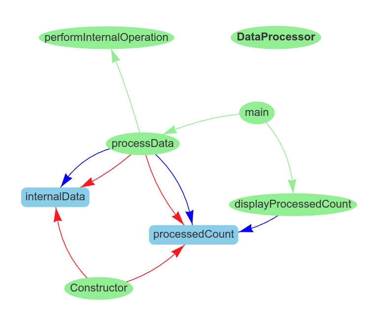

# PyClassViz
A tool to analyze Java code structure by extracting relationships between methods and fields, and visualizing them as interactive network graphs in the browser. Uses javalang for parsing and Pyvis for visualization.

# Draw example

Example of **DataProcessor.java** processing

